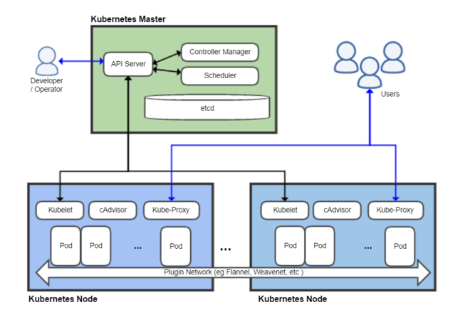

# Kubernetes Architecture

## Master
Manage, plan, schedule and monitor nodes.

## Node
Host applications as containers.

## etcd
Key-value store that contains the information about the cluster such as the desired and actual state.

## kube-scheduler
Identifies the right node to place the container based on the containers requirements, nodes capacity and other constraints.

## Controller Manger

### Node Controller
Ensures that nodes are available and get recreated.

### Replication Controller
Controls replications of pods and container.

## API Server
Exposes Kubernetes API to mange and monitor the cluster by the administrator.

## Kubelet
An agent that runs on each node and listens to instructions from the API server. The API server fetches periodically information from the Kubelet agent to monitor the state.

## Kube Proxy
Ensures that containers can communicate with each other within the cluster.
